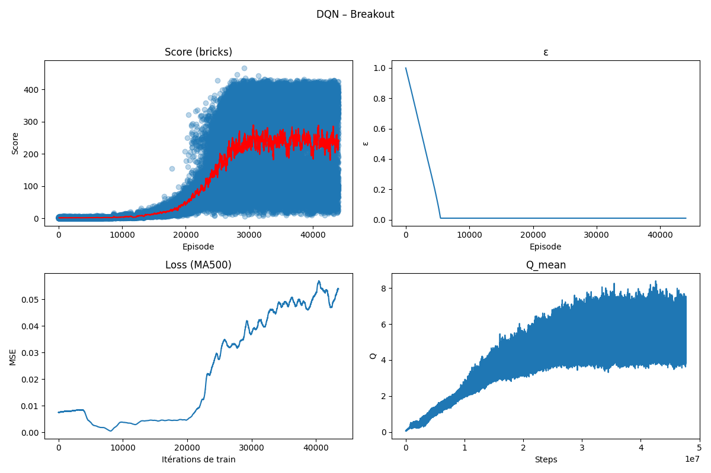
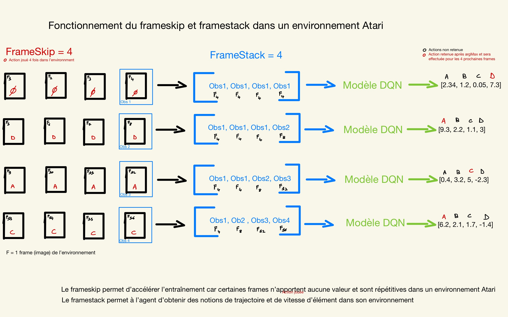
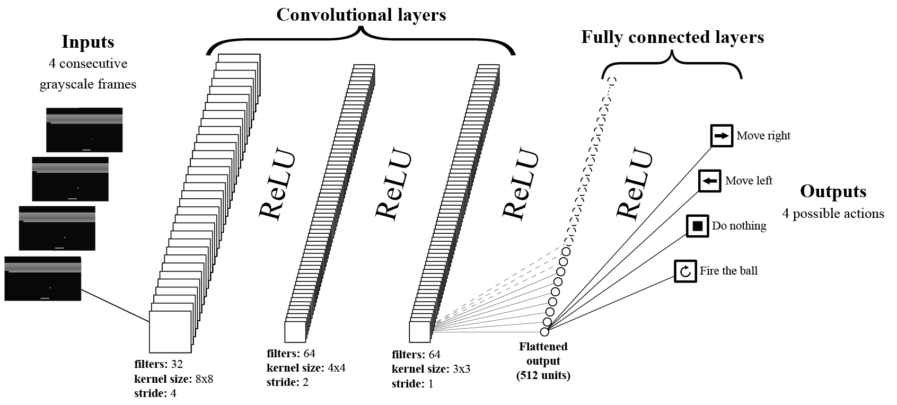
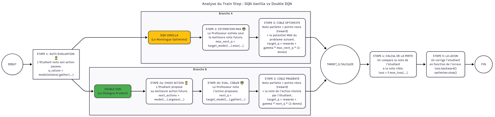
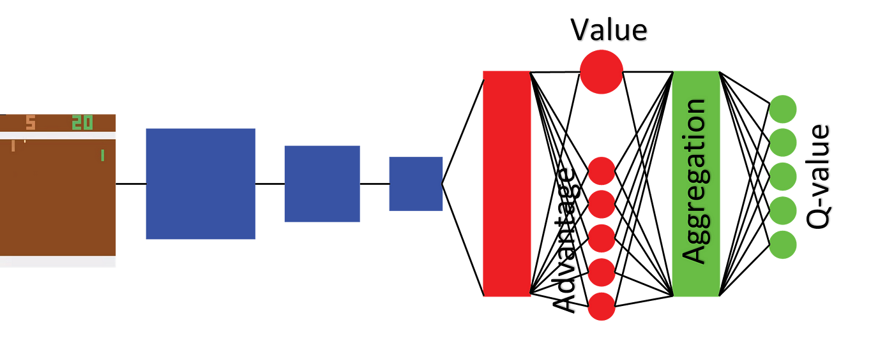

# Reinforcement Learning Agent for Atari Games

Ce projet présente une implémentation d'un agent d'apprentissage par renforcement profond basé sur l'algorithme DQN (Deep Q-Network) pour jouer à des jeux Atari. Le code est développé en utilisant **PyTorch** et **Gymnasium**.

L'implémentation intègre plusieurs améliorations clés inspirées des recherches de DeepMind pour améliorer la performance et la stabilité de l'entraînement, notamment :

  * **Double DQN** pour réduire la surévaluation des Q-values.
  * Une architecture de réseau **Dueling DQN** pour mieux estimer la valeur des états.
  * Un traitement avancé des observations (Frame Skipping et Frame Stacking).
  * Un Replay Buffer pour décorréler les expériences passées.

## Résultats Obtenus

Voici un aperçu des performances de l'agent après un entraînement complet.

**Métriques d'entraînement finales :**



**Vidéo de la meilleure exécution :**


-----

## ⚙️ Installation

Suivez ces étapes pour configurer votre environnement et installer les dépendances nécessaires.

### Prérequis

  * Git
  * Conda (ou Miniconda)

### Étapes d'installation

1.  **Cloner le dépôt**

    ```bash
    git clone git@github.com:ArrnaudMoreau22/reinforcement_learning_atari.git
    cd reinforcement_learning_atari
    ```

2.  **Créer et activer l'environnement Conda**
    Je recommande d'utiliser un environnement virtuel pour isoler les dépendances du projet.

    ```bash
    # Crée un environnement nommé 'rl_gymnasium' avec Python 3.9
    conda create -n rl_gymnasium python=3.9

    # Active l'environnement
    conda activate rl_gymnasium
    ```

3.  **Installer les dépendances**
    Le fichier `requirement.txt` contient toutes les bibliothèques Python nécessaires.

    ```bash
    pip install -r requirement.txt
    ```

    Cela installera les bibliothèques principales telles que `torch`, `gymnasium[atari]`, `ale-py`, et `numpy`.

-----

## 🚀 Lancement de l'entraînement

Le script principal pour lancer l'entraînement est `run.py`. Vous pouvez personnaliser les hyperparamètres via les arguments de la ligne de commande.

### Commande de base

Pour lancer un entraînement sur l'environnement Pong avec les paramètres par défaut :

```bash
python run.py --env "ALE/Pong-v5"
```

### Arguments personnalisés

Vous pouvez ajuster les paramètres de l'entraînement. Par exemple, pour un entraînement plus court sur Breakout avec un *learning rate* différent :

```bash
python run.py \
    --env "ALE/Breakout-v5" \
    --total-steps 1000000 \
    --lr 0.0001 \
    --buffer-cap 100000 \
    --save-path "checkpoints/dqn_breakout_test.pth"
```

Quelques arguments clés :

  * `--env`: L'ID de l'environnement Gymnasium (ex: `"ALE/Pong-v5"`).
  * `--total-steps`: Le nombre total de pas d'environnement pour l'entraînement (défaut: 50M).
  * `--lr`: Le *learning rate* de l'optimiseur RMSprop (défaut: 0.00025).
  * `--batch-size`: La taille du batch échantillonné depuis le Replay Buffer (défaut: 32).
  * `--resume`: Chemin vers un checkpoint pour reprendre un entraînement (ex: `"checkpoints/dqn_breakout.pth"`).

-----

## 📂 Structure du Projet

Le projet est organisé en plusieurs fichiers modulaires :

  * `run.py`: Point d'entrée pour lancer l'entraînement. Gère les arguments de la ligne de commande.
  * `trainer.py`: Contient la boucle principale d'entraînement, la gestion de l'environnement, le monitoring et la sauvegarde.
  * `model.py`: Définit l'architecture du réseau de neurones (Dueling DQN).
  * `train_step.py`: Implémente une seule étape de mise à jour des poids du réseau (calcul de la perte et backpropagation) en utilisant la logique Double DQN.
  * `agent.utils.py`: Fournit des fonctions utilitaires pour l'agent, comme la sélection d'action ε-greedy.
  * `replay_buffer.py`: Classe pour le buffer de rejouabilité qui stocke les transitions `(s, a, r, s')`.
  * `preprocessing.py`: Contient les classes de prétraitement, notamment `FrameStack` pour empiler les observations.
  * `requirement.txt`: Liste des dépendances Python du projet.
  * `doc/`: Dossier contenant des ressources et illustrations sur les concepts clés.

-----

## 🧠 Concepts Clés Implémentés

Ce projet s'appuie sur plusieurs techniques fondamentales de l'apprentissage par renforcement profond.

### Frame Skipping & Frame Stacking

Pour des raisons d'efficacité et pour fournir un contexte temporel à l'agent, j'utilise deux techniques :



1.  **Frame Skipping** : Le wrapper `AtariPreprocessing` est configuré avec `frame_skip=4`. L'agent exécute la même action pendant 4 images consécutives et ne traite que la dernière, ce qui accélère l'entraînement.
2.  **Frame Stacking** : Pour que l'agent puisse percevoir le mouvement (ex: la direction de la balle), j'empile les 4 dernières images prétraitées en un seul tenseur d'état `(4, 84, 84)`. Ce tenseur est ensuite donné en entrée du réseau de neurones.

### Architecture DQN Vanilla

Avant d'aborder les améliorations apportées par le Double DQN et le Dueling DQN, il est important de comprendre l'architecture de base du DQN (Deep Q-Network) classique, telle que présentée dans l'étude fondatrice de DeepMind *["Human-level control through deep reinforcement learning"](https://arxiv.org/abs/1312.5602)* (Mnih et al., 2015) :



L'architecture Vanilla DQN utilise un réseau de neurones convolutionnel qui :

1.  **Traite les images** : Les couches convolutionnelles extraient les caractéristiques spatiales des frames empilées (4 x 84 x 84).
2.  **Apprend les représentations** : Les couches denses transforment ces caractéristiques en représentations de haut niveau.
3.  **Estime les Q-values** : La couche de sortie produit directement une Q-value pour chaque action possible.

Cette architecture simple mais révolutionnaire a permis pour la première fois d'atteindre des performances humaines sur plusieurs jeux Atari et constitue la base sur laquelle toutes les améliorations ultérieures sont construites.

### Double DQN

L'algorithme DQN classique souffre d'une surévaluation des Q-values car il utilise le même réseau (le *target network*) pour **sélectionner** la meilleure action future et pour **évaluer** sa valeur.

**Double DQN** corrige ce biais. Comme implémenté dans `train_step.py`, j'utilise :



1.  Le **réseau principal (policy\_net)** pour choisir la meilleure action pour l'état suivant (`argmax a' Q_policy(s', a')`).
2.  Le **réseau cible (target\_net)** pour évaluer la Q-value de cette action choisie (`Q_target(s', argmax a' Q_policy(s', a'))`).

Cette décorrélation entre la sélection et l'évaluation mène à des estimations de valeur plus précises et à un entraînement plus stable.

### Dueling DQN

L'architecture Dueling DQN, définie dans `model.py`, modifie la structure du réseau pour estimer deux quantités séparées :



1.  **La Valeur de l'État (V(s))** : Une sortie unique qui estime la qualité de l'état `s`, indépendamment de l'action choisie.
2.  **L'Avantage par Action (A(s, a))** : Une sortie pour chaque action qui représente l'avantage de choisir une action `a` par rapport aux autres dans cet état `s`.

Ces deux flux sont ensuite combinés pour produire les Q-values finales. Cette séparation permet au modèle d'apprendre plus efficacement quels états sont précieux sans avoir à apprendre l'effet de chaque action pour chaque état.
H
### Replay Buffer

Le Replay Buffer est un composant essentiel qui stocke les expériences passées de l'agent sous forme de transitions `(état, action, récompense, état_suivant)`. Cette technique, introduite avec le DQN original, permet de décorréler les échantillons d'entraînement et d'améliorer la stabilité de l'apprentissage.

**Configuration par défaut :**
- **Taille du buffer** : 500 000 transitions (paramètre `--buffer-cap`)
- **Taille des échantillons** : 32 transitions par batch (paramètre `--batch-size`)

**Considérations importantes pour la mémoire :**

Chaque transition stocke 4 frames de 84x84 pixels pour l'état actuel et l'état suivant, ce qui représente environ 56 KB par transition. Avec 500 000 transitions, le buffer peut consommer jusqu'à **28 GB de RAM**.

**Recommandations selon votre configuration :**
- **16 GB de RAM** : Réduisez à `--buffer-cap 200000` (~11 GB)
- **32 GB de RAM ou plus** : Vous pouvez conserver la taille par défaut (~28 GB)
- **64 GB de RAM ou plus** : Vous pouvez augmenter à `--buffer-cap 1_000_000` (~56 GB)

Pour ajuster la taille du buffer lors de l'entraînement :
```bash
python run.py --env "ALE/Pong-v5" --buffer-cap 200000
```

**Note :** Un buffer plus petit peut légèrement réduire les performances, mais reste préférable à un crash par manque de mémoire (OOM - Out Of Memory).

### Wrappers d'Environnement

Pour gérer les spécificités des jeux Atari, plusieurs wrappers `Gymnasium` sont utilisés dans `trainer.py`:

  * `AtariPreprocessing`: Effectue le prétraitement standard : redimensionne l'image en 84x84, la convertit en niveaux de gris, et gère le *frame-skipping*. L'option `terminal_on_life_loss=False` est activée pour que l'agent apprenne que perdre une vie n'est pas la fin de l'épisode.
  * `NoopResetEnv`: Commence chaque épisode par un nombre aléatoire d'actions "NO-OP" (ne rien faire) pour introduire de la stochasticité dans les conditions de départ.
  * `FireResetEnv` / `FireOnLifeLossEnv`: Pour les jeux comme Breakout, ces wrappers (actuellement commentés mais disponibles) envoient automatiquement l'action "FIRE" pour démarrer une partie ou après avoir perdu une vie.

-----

## 🛠️ Troubleshooting

### Problèmes courants et solutions

**🔥 Erreur "Out of Memory" (OOM)**
```
RuntimeError: CUDA out of memory
```
**Solutions :**
- Réduisez la taille du replay buffer : `--buffer-cap 200000`
- Diminuez la taille du batch : `--batch-size 16`
- Utilisez un GPU avec plus de VRAM ou entraînez sur CPU

**🐌 Entraînement très lent**
**Solutions :**
- Vérifiez que PyTorch utilise bien le GPU : `torch.cuda.is_available()`
- Réduisez le nombre total de steps pour un test : `--total-steps 1000000`
- Augmentez la fréquence de sauvegarde : surveillez le monitoring

**❌ Erreur d'environnement Atari**
```
gym.error.NamespaceError: Namespace ALE not found
```
**Solutions :**
- Réinstallez les dépendances Atari : `pip install gymnasium[atari]`
- Installez ALE : `pip install ale-py`

**📉 L'agent n'apprend pas / performances stagnantes**
**Solutions :**
- Vérifiez que epsilon décroît correctement dans les logs
- Augmentez le learning rate : `--lr 0.0005`
- Laissez plus de temps d'entraînement (50M steps minimum)
- Vérifiez que le replay buffer se remplit avant l'entraînement

## 📚 Références et Lectures Complémentaires

### Papers Fondamentaux

- **DQN Original** : [Human-level control through deep reinforcement learning](https://arxiv.org/abs/1312.5602) (Mnih et al., 2015)
- **Double DQN** : [Deep Reinforcement Learning with Double Q-learning](https://arxiv.org/abs/1509.06461) (van Hasselt et al., 2016)
- **Dueling DQN** : [Dueling Network Architectures for Deep Reinforcement Learning](https://arxiv.org/abs/1511.06581) (Wang et al., 2016)

### Ressources Supplémentaires

- **Cours OpenAI Spinning Up** : [spinningup.openai.com](https://spinningup.openai.com/en/latest/) - Guide complet sur l'apprentissage par renforcement
- **Documentation Gymnasium** : [gymnasium.farama.org](https://gymnasium.farama.org/) - Documentation officielle des environnements
- **PyTorch RL Tutorials** : [pytorch.org/tutorials](https://pytorch.org/tutorials/intermediate/reinforcement_q_learning.html) - Tutoriels officiels PyTorch sur le RL

### Améliorations Possibles

Ce projet peut être étendu avec d'autres techniques avancées :
- **Prioritized Experience Replay** : Échantillonnage intelligent du replay buffer
- **Rainbow DQN** : Combinaison de plusieurs améliorations DQN
- **Distributional RL** : Apprentissage de la distribution des récompenses
- **Noisy Networks** : Exploration par bruit paramétrique

## 🙏 Remerciements

Ce projet s'inspire directement des recherches révolutionnaires de **DeepMind** en apprentissage par renforcement profond. Je remercie particulièrement :

- **Volodymyr Mnih** et l'équipe DeepMind pour l'invention du DQN
- **Hado van Hasselt** pour l'algorithme Double DQN
- **Ziyu Wang** pour l'architecture Dueling DQN
- La communauté **OpenAI Gymnasium** pour les environnements Atari
- L'équipe **PyTorch** pour le framework de deep learning
- **Epitech** pour ce sujet passionnant et cette opportunité d'explorer l'apprentissage par renforcement profond

Ce travail démontre la puissance des techniques d'apprentissage par renforcement profond et leur capacité à résoudre des tâches complexes de contrôle séquentiel.

## ⭐ Vous avez trouvé ce projet utile ?

Si ce repository vous a été utile ou informatif, n'hésitez pas à lui donner une étoile ! ⭐

Cela m'aide énormément et encourage à continuer le développement de projets éducatifs en IA et apprentissage par renforcement.

[⭐ Donner une étoile au repository](https://github.com/ArrnaudMoreau22/reinforcement_learning_atari)

---

*Développé avec ❤️ pour l'apprentissage et la recherche en IA*
